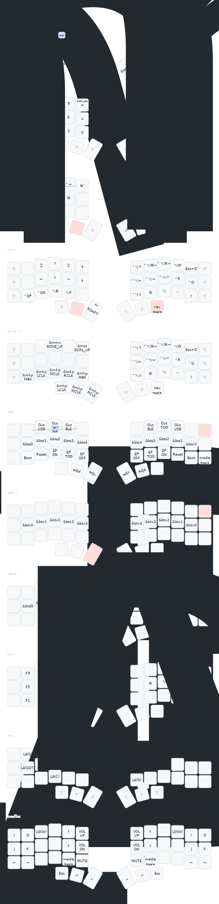

# ZMK config

for 3x6 [Rollow](https://www.barbellboards.com/product/rollow)

## keymap



## build

Ensure docker is available. On macos, see https://github.com/abiosoft/colima. Then:

```sh
$ docker/docker.sh make init|update|build
```

The script will use a volume to store intermediate build state. `init` needs to be run once, `update` once or whenever dependencies need refreshing, `build` for building the firmware. 

Only the left side image gets build by default. To build both sides, define `ZBE_SIDES="left right"` in the environment:

```sh
$ ZBE_SIDES="left right" docker/docker.sh make build
```
